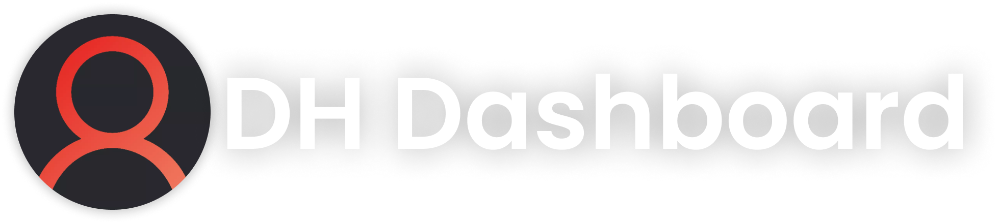

	

<h1 align="left"><strong>DH Dashboard</strong></h1>

Dashboard for the open-source multi-purpose Discord bot for Draavo's Hangout written in TypeScript.

## Information

Please read this if you are thinking of hosting this dashboard yourself. This project is open-sourced because I do not earn money with it. **You are allowed to host it yourself, but do not show in any way that this dashboard is created by you**. I didn't use complicated licenses because I don't want to go through all that copyright shit, I only need you guys to **leave the credits where they are**, that's all. Very simple.

This dashboard is designed to work with the [DH Assistant bot](https://daangamesdg.wtf/github/dh-assistant), **some features may not work as expected on other servers**. [The discord bot](https://daangamesdg.wtf/github/dh-dashboard) is part of this project, you will need it in order to run this project!

**DO NOT INSTALL OLDER VERSIONS**, please check [the security policy](/SECURITY.md) for all the supported versions. If you still want to use an older version, use it at your own risk. **I am in no way responsible for any damage done to the bot, you or your pc/hardware used to run the bot**. I will also not provide any support for deprecated versions.

## Install

**This project is still WIP, please stop DMing me "How to install, not working" kinda stuff cuz it's not finished yet**. You will see a small description here that will redirect you to an installation page **once this bot is fully working and operational!**

## Author

👤 **DaanGamesDG**

-   Website: https://daangamesdg.wtf/
-   Email: <daan@daangamesdg.wtf>
-   Twitter: [@DaanGamesDG](https://twitter.com/DaanGamesDG)
-   Github: [@DaanGamesDG](https://github.com/DaanGamesDG)

## Donate

This will always be open source project, even if I don't receive donations. But there are still people out there that want to donate, so if you do here is the link [PayPal](https://paypal.me/daangamesdg) or to [Ko-Fi](https://daangamesdg.wtf/kofi). Thanks in advance! I really appriciate it <3

## Lisence

Project is licensed under the © [**MIT License**](/LICENSE)

---
